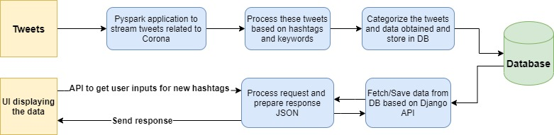

# Social Data Analysis Platform
<!-- ALL-CONTRIBUTORS-BADGE:START - Do not remove or modify this section -->

<!-- ALL-CONTRIBUTORS-BADGE:END -->
Currently crunching twitter data and transforming that to several categories and using a web platform to show the data to the world. 

It's inspired by COVID-19, but can be used for any trending topic's dashboard

## Implementation Plan:

* Build PySpark Streaming app using NLTK for categorizing tweets
* Saving data on to Mongo Database
Visualization of the Data on DB using a web platform
* Implement a user login based platform where users could request for additional twitter tags from which we need to pull data.
* Generate statistics based on the above data.
* Will visualize statistics in the later phase.

# Web Platform Technologies considered:
* Django based API Implementation.
* React based frontend.

## Block Diagram

## Contributors ✨

Thanks goes to these wonderful people ([emoji key](https://allcontributors.org/docs/en/emoji-key)):

<!-- ALL-CONTRIBUTORS-LIST:START - Do not remove or modify this section -->
<!-- prettier-ignore-start -->
<!-- markdownlint-disable -->
<table>
  <tr>
    <td align="center"><a href="https://jino.work"> <b>Jino Jossy</b></a> <a href="#platform-jinojossy93" title="Packaging/porting to new platform">📦</a></td>
    <td align="center"><a href="https://github.com/joannjacob"> <b>joannjacob</b></a> <a href="https://github.com/qburst/dashboard-for-socialmedia-trend/commits?author=joannjacob" title="Code">💻</a></td>
  </tr>
</table>

<!-- markdownlint-enable -->
<!-- prettier-ignore-end -->
<!-- ALL-CONTRIBUTORS-LIST:END -->

This project follows the [all-contributors](https://github.com/all-contributors/all-contributors) specification. Contributions of any kind welcome!